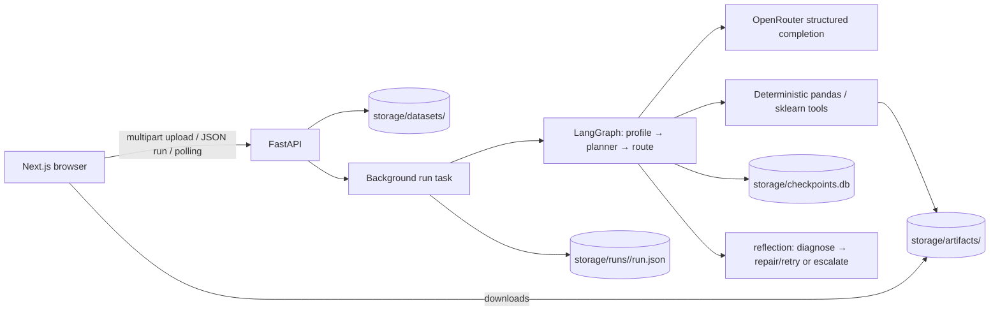
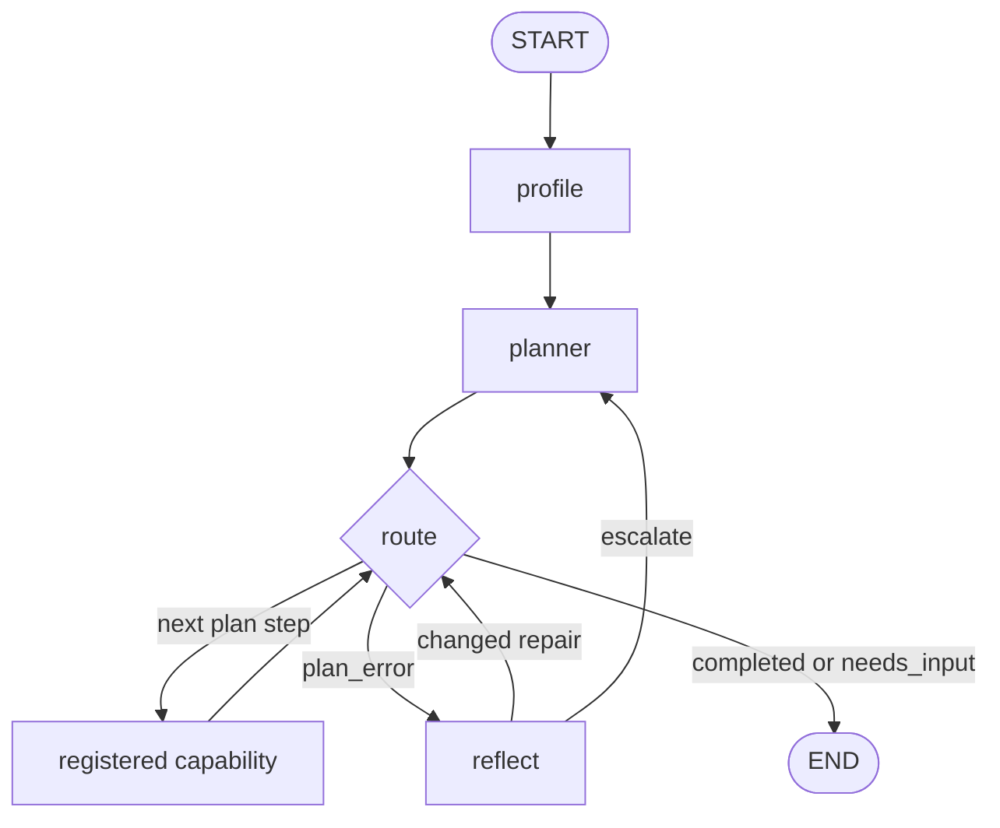

# PROJECT_CONTEXT — AI Data Science Platform


## 1. Project overview

**Project name:** the README and FastAPI title use **AI Data Science Platform**. The README calls this a working title; `frontend/package.json` calls the UI `ai-data-science-frontend`.

**Purpose and users.** This is a local, filesystem-backed automated tabular-data ML application. A user uploads CSV, Parquet, XLSX, or XLS data and describes a prediction goal. The backend profiles the data, uses LLM agents only for bounded decisions and prose, executes deterministic pandas/scikit-learn work, and produces a trained model, held-out metrics, feature importance, recommendations, and a Markdown report. Its intended user is a business/data practitioner who wants an assisted baseline workflow rather than to author a notebook.

**Problem addressed.** Tabular ML requires a sequence of interdependent choices—selecting a target, excluding ID/leakage columns, cleaning, transforming, fitting, evaluating, explaining, and communicating findings. The code centralizes that workflow into a registry-validated plan and retains artifacts on disk. This matters because an LLM should not be trusted to emit executable modeling code or invent data facts; here it emits validated structured decisions while deterministic tools perform the data operations.

### Implemented capabilities

1. Upload, parse validation, metadata/profile persistence, dataset listing, and profile retrieval.
2. Deterministic profiling of schema, missingness, simple statistics, role hints, duplicate count, memory use, and warnings.
3. OpenRouter-backed structured LLM calls with Pydantic validation, plus a fake client for tests.
4. Four LLM agents: EDA insights, problem specification, feature plan, and recommendations; one LLM planner; and an LLM fallback reflection diagnoser.
5. Deterministic cleaning, row-wise feature engineering, four candidate estimators per task type, cross-validation, held-out evaluation, SHAP/permutation explainability, report generation, and model/report download routes.
6. Static LangGraph topology with a dynamic, validator-checked capability order, SQLite checkpoints, and bounded reflection/repair/escalation loops.
7. A Next.js UI that uploads, creates a run, polls it, renders the returned run payload, and downloads artifacts.

### Important boundary: implemented vs. planned/documentation-only

| Topic | Status | Evidence / qualification |
|---|---|---|
| Dynamic plan selected from capability registry | Implemented | `backend/app/planner/*`, `graph/builder.py` |
| Reflection diagnosis and deterministic artifact repairs | Implemented | `backend/app/reflection/*`, `tools/repair_ops.py` |
| Model swap or search-space reduction after a planner hint | **Not implemented** | `_handle_escalation()` only retries the existing plan/cursor; it stores a hint in warnings. |
| Multi-user database/run tracking | Planned only | Dataset route docstring says a database comes when multi-user tracking requires it; current records are JSON files. |
| Frontend as a complete product | Partially implemented | Upload/run/result API integration exists. Marketing sections and fixed example metrics/content also exist; email form prevents default and the GitHub link is `https://github.com`. |
| Optuna | Documentation claim only | README architectural bullet names Optuna; it is neither required nor imported. |
| RAG/vector DB/embeddings/BM25/FAISS | Not found | No corresponding source or dependency use. |
| Authentication/authorization | Not found | API routes have no auth middleware/dependencies. |
| Docker/CI/deployment manifests | Not found | No Dockerfile, compose file, workflow, or deployment configuration in the inventory. |

## 2. Complete, actually used technical stack

| Technology | Where used | Why / actual role |
|---|---|---|
| Python | `backend/app`, tests | Backend implementation. |
| FastAPI + Uvicorn | `app/main.py`, route modules | HTTP API, automatic docs, background tasks, CORS. |
| Pydantic v2 / pydantic-settings | agents, API schemas, report/reflection/planner models; `core/config.py` | Structured LLM/API payload validation and environment-backed settings. |
| LangGraph + `langgraph-checkpoint-sqlite` | `graph/builder.py` | Static state graph with conditional routing and SQLite checkpoint saver. |
| SQLite | `storage/checkpoints.db` | LangGraph checkpoint persistence; not application relational storage. |
| pandas / NumPy / PyArrow / OpenPyXL | profiler, tools, repair operations | Tabular reading/manipulation and Parquet/Excel support. |
| scikit-learn | training/evaluation/explanation | `ColumnTransformer`, preprocessing pipelines, CV, metrics, candidate estimators, permutation importance. |
| XGBoost / LightGBM | `tools/training.py` | Two of four candidate estimators for classification/regression. |
| joblib | training/evaluation/explain | Persist and reload fitted pipeline at `model.joblib`. |
| SHAP (optional at runtime) | `tools/explain.py` | Tree/linear feature attribution; guarded import falls back to permutation importance. |
| OpenAI Python SDK | `llm/openrouter_client.py` | Transport to OpenRouter’s OpenAI-compatible chat-completions API. |
| OpenRouter / configured LLM model | `OpenRouterClient`; config default `anthropic/claude-sonnet-4.5` | One structured-completion provider adapter. No embedding provider/model is implemented. |
| pytest / httpx | `backend/tests`, requirements | Test framework; `httpx` is listed but no imports were found. |
| TypeScript / Next.js 14 / React 18 | `frontend` | Browser client, page/state/UI composition. |
| Tailwind CSS / PostCSS / Autoprefixer | frontend config/styles | Styling. |
| Framer Motion, Lucide, Three.js, Radix Slot, CVA, clsx, tailwind-merge | frontend components | Animation, icons, WebGL decorative shader, composable button and class composition. |

Dependencies merely listed but not evidenced as used include `httpx`. The README’s Optuna mention is unsupported. There is no database ORM, vector store, retrieval library, Docker/build system beyond npm and Python packaging, or observability SaaS integration.

## 3. Repository structure and responsibilities

```text
backend/
├── app/
│   ├── api/                 FastAPI schemas and datasets/insights/runs routes
│   ├── agents/              LLM decision/prose agents
│   ├── core/config.py       settings and storage directory creation
│   ├── graph/               RunState, nodes, LangGraph construction
│   ├── llm/                 provider-agnostic contract, factory, OpenRouter/fake clients
│   ├── planner/             capability metadata, LLM planner, validator, router
│   ├── reflection/          taxonomy, diagnosis, repair choice/registry, control node
│   ├── tools/               deterministic dataframe/ML/report/repair work
│   └── main.py              API application and router registration
├── tests/                   124 discovered test functions
├── docs/reflection_layer_design.md  design document; overlaps implemented reflection code
└── requirements.txt
frontend/
├── app/                     Next root layout, home page, global CSS
├── components/sections/     functional hero/report and informational marketing sections
├── components/ui/           button and client-side WebGL shader
├── lib/api.ts               API base, safe JSON parser, polling helper
└── package.json             npm scripts/dependencies
README.md                    setup and high-level phase claims
```

Key architectural files: `graph/nodes.py` adapts state to tools/agents; `planner/registry.py` is the authoritative capability DAG metadata; `planner/planner_node.py` validates/dispatches plans; `graph/builder.py` compiles the graph and checkpoint store. Tools deliberately do not depend on LangGraph or LLMs. Reflection runners adapt graph state to independently testable `repair_ops` primitives.

## 4. High-level architecture



**Inputs:** a persisted raw file, a dataset id, and free-text business problem. **Output:** a JSON `RunResponse`, a model joblib, and report Markdown. **Primary failure behavior:** upload errors become 400/413; a run graph exception produces persisted `failed`; invalid planning/exhausted remediation produces `needs_input`; frontend turns a terminal failed/needs-input run into a client error.

## 5. Real end-to-end execution flow

Example: upload `customers.csv` with `customer_id`, `signup_date`, `income`, `plan`, and binary `churned`; submit “Predict customers likely to churn.”

1. `POST /api/datasets/upload` reads the full `UploadFile`, accepts only `.csv/.parquet/.xlsx/.xls`, rejects empty or over `APP_MAX_UPLOAD_MB` (default 200), creates a 12-hex dataset directory, writes `raw.<ext>`, calls `profile_dataset`, then writes `metadata.json` and `profile.json`.
2. `POST /api/runs` validates dataset metadata exists, allocates a 12-hex run id, writes a `running` JSON record, seeds reflection control values, and schedules `_execute_run` in FastAPI `BackgroundTasks`.
3. `_execute_run` builds/caches the graph, invokes it with `thread_id=run_id` and a bounded recursion limit: `len(REGISTRY) + 2*repair_attempts + 2*replan_attempts + 10` (with defaults: 11 + 8 + 4 + 10 = 33).
4. `profile_node` loads cached dataset profile or profiles `raw.*`; state receives only the profile dict. No raw dataframe is put into state.
5. `planner_node` asks `PlannerAgent` for exact registered capability names. The validator rejects unknown names, empty plans, unsatisfied requirements, duplicate producers, and plans not producing both `summary` and `report`; invalid attempts feed errors back to the planner up to `APP_PLAN_ATTEMPTS` (3).
6. A normal canonical plan can run `insights` (optional), then `problem_spec`, `cleaning`, `feature_plan`, `features`, `training`, `evaluation`, `explain`, `recommendations`, `summarize`, and `report`. Every capability wrapper increments `plan_cursor` only after success.
7. The LLM chooses target/problem/drop decisions; `clean_dataset` writes `cleaned.parquet`; the LLM sees a profile of that cleaned artifact and chooses leak-safe feature transformations; `engineer_features` writes `features.parquet`.
8. `train_models` constructs a preprocessing-plus-estimator pipeline per candidate, runs CV, selects max mean score, refits winner on all data, and writes `model.joblib`. `evaluate_model` clones that persisted pipeline and fits only its 80% split before scoring the 20% holdout.
9. `explain_model` samples at most 200 rows and tries SHAP; then permutation importance; then returns `unavailable` without raising. Recommendations receive only problem spec, metrics, and importance data. `assemble_report` writes `report.md`.
10. On a capability exception, `_make_capability_node` records error/type without advancing cursor. `route()` sends execution to `reflect`. A confident regex taxonomy diagnosis avoids an LLM. A changed repair rewrites the features artifact in place (or updates `problem_spec.cv_folds`) and re-dispatches the same step; otherwise it escalates. Final state is serialized to the run record. Browser polling ends when status is no longer `running`/`queued`.

## 6. Core deterministic algorithms and logic

### Profiling and heuristic role hints

`profile_dataset()` produces per-column semantic dtypes, missing %, uniqueness, descriptive numeric stats or top five categorical values, role hints, and warnings. A column is `constant` at ≤1 unique; `id_like` when unique/rows ≥ **0.98**; `binary` at 2 unique; object `high_cardinality` when unique/rows ≥ **0.5**. Warnings trigger for duplicates, missingness > **30%**, constants, and ID-like columns. Date strings are detected by attempting `pd.to_datetime(..., format="mixed")` on up to 50 non-null values. Empty datasets avoid division by zero but can later fail model validation.

### Cleaning and feature engineering

`clean_dataset()` drops agent-selected existing non-target columns, optionally de-duplicates, always drops rows with a missing target, and writes Parquet. `engineer_features()` is intentionally restricted to row-wise transforms safe before splitting: it expands chosen dates to `year/month/day/dayofweek`; applies `log1p` only to present, numeric, non-target columns with no negative value; and drops selected non-target columns. It reports skipped transformations. Learned preprocessing is deferred to the training pipeline to avoid validation/test leakage.

### Training / model selection

For features `X` and target `y`, numeric columns receive `SimpleImputer(median)` then `StandardScaler`; remaining columns receive `SimpleImputer(most_frequent)` then dense `OneHotEncoder(handle_unknown="ignore")`. This `ColumnTransformer` is inside each sklearn `Pipeline`, therefore fitted within each CV training fold.

Classification candidates are `LogisticRegression(max_iter=2000)`, random forest (200 trees), XGBoost (200 estimators, `eval_metric=logloss`), and LightGBM (200 estimators). Regression candidates are Ridge plus corresponding RF/XGBoost/LightGBM regressors. `RANDOM_STATE=42` is passed to listed estimators. Five folds is default, clamped at minimum 2; scoring is `roc_auc` or negative RMSE. The highest mean CV score wins, then is fit on all data for deployment persistence. Limitations: no hyperparameter search, no explicit stratified/group/time-series CV configuration, no feature selection, and a binary-only ROC-AUC/evaluation implementation.

### Evaluation and explainability

Evaluation uses `train_test_split(test_size=0.2, random_state=42, stratify=y)` for classification, clones the all-data persisted pipeline, and refits on train only. Classification reports accuracy/precision/recall/F1 and, when `predict_proba` exists, `roc_auc` using column 1; regression reports RMSE/MAE/R². This means model selection CV was conducted over the full prepared data before the separate reported holdout split—good preprocessing isolation, but not nested model selection.

Explainability first bounds data to 200 randomly sampled rows. Tree models use `shap.TreeExplainer`; logistic/ridge use `shap.LinearExplainer`; global importance is mean absolute SHAP value, with direction from mean signed value. SHAP output lists/3-D arrays reduce to last/positive output. If that fails/missing, `permutation_importance(..., n_repeats=5, random_state=42)` is run over the pipeline. Failed fallback yields an empty `unavailable` report instead of failing the run.

### Planner validation

`validate_plan` walks ordered names from bootstrap artifacts `{run_id,dataset_id,problem_text,profile}`. At step i, every `requires` key must already be produced; each artifact may have only one producer; and final output must include `summary` and `report`. The planner agent removes hallucinated/unregistered names and duplicates before validation, but validation remains authoritative.

## 7. LLM and agent architecture

`LLMClient` is a protocol exposing only `complete(system, user, schema)`. `get_llm_client()` supports only provider `openrouter`; absent key or unknown provider raises a runtime error. `OpenRouterClient` calls the OpenAI SDK against `https://openrouter.ai/api/v1`, using configured model and 120-second SDK timeout / SDK `max_retries=2`. It embeds `schema.model_json_schema()` in the system prompt, strips fences, Pydantic-validates JSON, and asks for corrected JSON on failure for **2** validation retries (three calls max). It maps auth, rate-limit, and API errors to custom exceptions. No temperature, token cap, tool calling, streaming, caching, or cost instrumentation is set in code.

| Agent | Input / output | Safety and consumption |
|---|---|---|
| `EDAInsightsAgent` | profile → `InsightReport(summary, 5–10 Insight, suggested_target)` | Prompt says use profile only; saved optionally in run/report. |
| `ProblemSpecAgent` | goal + profile → classification/regression, exact target, drops, duplicate flag | Checks target is an actual column; filters drops to valid non-targets; downstream cleaning/training consume it. |
| `FeatureEngineeringAgent` | problem spec + cleaned profile → datetime/log/drop plan | Filters invalid/duplicate/target columns; feature tool executes it. |
| `RecommendationsAgent` | problem spec + metrics + importance → narrative and 3–6 recommendations | Caps to 6; prompt grounds statements to supplied numbers/features; report consumes it. |
| `PlannerAgent` | profile + goal + registry + validator feedback → `ExecutionPlan` | Can only name listed capabilities; structural validator decides execution. |
| `ReflectionAgent` | capability/error/type → `Diagnosis` | Regex heuristic first; unknown/low confidence calls LLM under `APP_DIAGNOSIS_TIMEOUT_S` default 20 seconds and falls back to heuristic on timeout/error. |

## 8–10. State, graph, and reflection orchestration

`RunState` is a non-total TypedDict. It holds ids, request text, compact reports/plans/control flags, and artifact paths—not dataframes or fitted objects. This makes JSON/SQLite checkpointing relatively cheap. Main lifecycle: `profile` creates `profile`; planner creates `execution_plan`, reasoning/cursor; nodes add their named reports; summarize sets `summary`/`completed`; report adds final structured report. API seeds `status=running`, reflection history/counters, and escalation false.

| State field group | Created / changed by | Read by | Meaning |
|---|---|---|---|
| `run_id`, `dataset_id`, `problem_text`, `status` | API; `summarize_node` terminal status | all path/control/API functions | Run identity, dataset identity, user goal, lifecycle value. |
| `profile`, `insights` | profile node; optional insights agent | planner, problem/feature agents, report/summary | Compact profile and optional LLM data-quality prose. |
| `problem_spec`, `cleaning_report`, `feature_plan`, `feature_report` | problem/cleaning/feature nodes | later data tools/reflection/report | Modeling decision and the paths/reports of preparation artifacts. |
| `training_report`, `evaluation_report`, `explanation_report` | training/evaluation/explain nodes | recommendations/report/summary/reflection schema repair | Leaderboard/model path/schema, held-out metrics, and importance report. |
| `recommendations`, `report`, `summary` | recommendations/report/summarize nodes | report/API/frontend | Business prose, consolidated payload/report path, final textual summary. |
| `execution_plan`, `plan_reasoning`, `plan_cursor`, `replan_count` | planner/capability wrapper | `route`, planner | Valid plan, its explanation, next index, bounded escalations consumed. |
| `warnings`, `errors`, `plan_error`, `failed_capability`, `failed_exc_type` | planner/wrapper/reflection | route/reflection/API | Human-facing notices/terminal errors and the current failure envelope. |
| `reflection_history`, `reflection_attempts`, `repair_attempts`, `last_repair`, `pending_retry_capability`, `escalate_to_planner`, `planner_hint` | API seeds; reflection node | route/planner/API | Auditable repair records and bounded-loop control; all are JSON-serializable dict/list/scalars. |



The registry has 11 capability nodes. `insights` is optional and no capability requires it; all other normal outputs chain to terminal `summary` and `report`. State cursor points at the currently failing node because failed wrappers do not advance it. Checkpoint state is keyed by `thread_id=run_id`; a graph rebuilt in a process uses cached `build_graph()` and one SQLite connection configured `check_same_thread=False`.

### Reflection policy

Failure categories: `DATA_SCHEMA_ERROR`, `TARGET_ENCODING_ERROR`, `MISSING_VALUES`, `TYPE_ERROR`, `MODEL_CONFIGURATION_ERROR`, `RESOURCE_LIMIT`, `TRANSIENT_ERROR`, `VALIDATION_ERROR`, `UNKNOWN_ERROR`. Heuristics are ordered and case-insensitive; known confidence scores range 0.7–0.9, unknown 0.2; acceptance threshold is 0.6. Repairs include label encoding, numeric coercion, date expansion, feature missing-value imputation, invalid row removal, constant-column drop, schema realignment, CV-fold reduction, and plain retry for transient errors. Artifact repairs operate on `feature_report.features_path` in place. `label_encode_target` maps known binary pairs (No/Yes etc.) to 0/1 or deterministically factorizes sorted labels. `reduce_cv_folds` writes a `problem_spec.cv_folds` knob (floor 2).

Budgets are independent: **2** reflection cycles per failed capability, **4** repairs per run, **2** planner escalations, plus graph recursion limit. Any no-op/unknown repair, missing failure identity, exhausted budget, resource/model planning concern, or unrepaired condition escalates. A material limitation: planner escalation currently does **not** regenerate/modify a plan or swap models despite design language; `_handle_escalation` retries current cursor until exhausted, then `needs_input`. Also `ReflectionRecord.retry_succeeded` is always initialized `None`; no later node updates it.

## 11. Data and storage flow

`APP_DATA_DIR` defaults to relative `storage`. Layout:

```text
storage/
├── datasets/<dataset_id>/raw.<csv|parquet|xlsx|xls>
│   ├── metadata.json
│   ├── profile.json
│   └── insights.json                 # only direct insights endpoint cache
├── artifacts/<run_id>/cleaned.parquet
│   ├── features.parquet
│   ├── model.joblib
│   └── report.md
├── runs/<run_id>/run.json
└── checkpoints.db
```

The system reads raw CSV/Parquet/Excel but writes intermediate tabular artifacts as Parquet. The planner sees profiles, agents do not see raw row data, and the final run JSON serializes compact outputs. Filesystem artifacts are mutable: repairs rewrite `features.parquet` in place. Run JSON is only written at creation and terminal completion/failure, not after each graph node; per-node durability is supplied separately by LangGraph checkpointing.

## 12. Retrieval system

There is no retrieval implementation. No document ingestion/chunking, embeddings, vector database, BM25, FAISS, RRF, reranking, evidence grader, query rewriting, or RAG route was found. Do not describe this project as RAG-enabled.

## 13. API contracts

| Method / URL | Request | Success response / side effect | Failures |
|---|---|---|---|
| `GET /api/health` | none | `{status:"ok", version:"0.1.0"}` | none coded |
| `POST /api/datasets/upload` | multipart `file` | `DatasetUploadResponse`; writes raw/meta/profile | 400 absent/empty/unsupported/unparseable; 413 too large |
| `GET /api/datasets` | none | list of metadata items | malformed storage JSON may propagate |
| `GET /api/datasets/{id}/profile` | path id | profile payload | 404 missing metadata |
| `POST /api/datasets/{id}/insights` | path id | `InsightReport`, cached at `insights.json` | 404; mapped LLM auth as 500 and LLM error as 502 |
| `POST /api/runs` | `{dataset_id, problem_text=""}` | immediate running `RunResponse`; schedules background graph | 404 nonexistent dataset |
| `GET /api/runs/{id}` | path id | persisted `RunResponse` | 404 missing run JSON |
| `GET /api/runs` | none | run records in reverse lexicographic directory order | none coded |
| `GET /api/runs/{id}/model` | path id | joblib attachment | 404 absent |
| `GET /api/runs/{id}/report` | path id | Markdown attachment | 404 absent |

There is no auth, pagination, filtering, cancellation, SSE, WebSocket, streaming, or progress-event endpoint. Routes are mounted under `/api/datasets` and `/api/runs`; FastAPI docs are available at default `/docs` when running.

Example requests (field names match the source):

```http
POST /api/runs
Content-Type: application/json

{"dataset_id":"a1b2c3d4e5f6","problem_text":"Predict churn."}
```

The immediate response contains the generated `run_id`, original dataset/problem, ISO `created_at`, and `status: "running"`. A terminal `GET /api/runs/{run_id}` can additionally contain plan/reasoning, reports, `summary`, warnings/errors, reflection history, and `status` of `completed`, `failed`, or `needs_input`. Exact metric/report fields vary by task and completed capabilities.

## 14. Frontend

`app/page.tsx` owns a single `RunResult | null`; before result it renders `HeroSection`, after it renders `ReportView`. Hero state handles drag/drop/file input, uses `FormData` to upload, posts JSON to create the run, then `pollRun()` every 2 s up to 15 minutes. `parseJSON()` requires JSON content type and exposes server `detail`; errors are displayed in the UI. `ReportView` renders returned metrics/leaderboard/importance/recommendations and downloads report/model using the run URLs.

`NEXT_PUBLIC_API_URL` defaults to `http://localhost:8000`. CORS backend defaults allow localhost 5173/3000 and `https://data-science-copilot-red.vercel.app`. Informational sections (`architecture`, roadmap, capability registry, etc.) are presentational. `report-view.tsx` includes hard-coded example display values in its implementation in addition to result rendering, so visual UI copy must not be treated as measured runtime performance.

## 15. Configuration

| Variable | Default | Effect / use |
|---|---|---|
| `APP_DATA_DIR` | `storage` | Dataset/artifact/run/checkpoint root |
| `APP_CORS_ORIGINS` | local ports + named Vercel URL | FastAPI allowed origins |
| `APP_MAX_UPLOAD_MB` | 200 | Upload byte limit |
| `APP_LLM_PROVIDER` | `openrouter` | Factory provider selector (only supported value) |
| `APP_LLM_MODEL` | `anthropic/claude-sonnet-4.5` | OpenRouter model name |
| `APP_OPENROUTER_API_KEY` | empty | Required to construct actual client; never expose it |
| `APP_PLAN_ATTEMPTS` | 3 | LLM plan validation attempts |
| `APP_REPLAN_ATTEMPTS` | 2 | Planner escalation budget |
| `APP_REFLECTION_ATTEMPTS` | 2 | Per-capability reflection budget |
| `APP_REPAIR_ATTEMPTS` | 4 | Run-wide repair budget |
| `APP_DIAGNOSIS_TIMEOUT_S` | 20.0 | Worker-thread LLM diagnosis wait bound |

Settings load `.env`, use `APP_` prefix, ignore extra fields, and create datasets/artifacts directories at import time. Frontend config is distinct and public via `NEXT_PUBLIC_API_URL`.

## 16. Error handling, observability, security, reliability

**Handling/logging.** The API maps selected upload/insights errors to HTTP exceptions. Graph capability exceptions are caught and converted into state, then reflection decisions. Explainability is explicitly non-fatal. LLM structured output retry and planner retry are bounded. Logging calls record run id, profile shape, planning, node outcomes, reflection diagnosis/repair/escalation, and warnings. No structured log configuration, request correlation middleware, timing spans beyond `ReflectionRecord.duration_ms`, metrics endpoint, tracing, or external telemetry is present. Prompts receive profile/statistical summaries rather than raw dataframe rows; raw exception text and reflection history are persisted, however.

**Supported protections.** File extension allowlist, size/empty checks, parse-before-accept, generated server-side ids, target preservation in cleaning/features, target/drop filtering after LLM output, registry-bound planner, plan DAG validation, dense bounded control loops, preprocessing inside CV pipelines, and no source-code mutation by repair operations.

**Known gaps grounded in code.** Upload reads the full payload into memory before size decision; extensions are not content-type or malware validation. No authentication/ownership means any caller with IDs can list/download records. Paths are derived from server IDs rather than user filenames, which reduces traversal exposure, but filesystem storage has no encryption/retention/tenant isolation. Pydantic does not sanitize untrusted dataset textual content before it enters prompts via profile top values; prompt injection protections are not explicit. BackgroundTasks are process-local and run persistence lacks an explicit queued-job system/cancellation/recovery worker. There are no resource quotas for rows/columns/model CPU/memory, and training uses `n_jobs=-1`. No concurrency/locking around shared artifacts/run JSON is implemented. `FileResponse` exposes serialized joblib; untrusted joblib must never be loaded outside trusted code.

## 17. Testing and verification

There are **124 discovered `def test_` functions** across 21 test modules. Tests use deterministic synthetic data and `FakeLLMClient`. Coverage includes profiler-to-pipeline wiring, cleaning/feature guards, classification/regression training/evaluation, explainability primary/fallback/unavailable paths, report formatting, agent grounding/filtering, registry and DAG validator, routing/resume, heuristic/LLM diagnosis fallback, taxonomy, repair primitives/registry/selection, reflection budgets/escalation, and one flaky pipeline recovery flow.

The end-to-end test exercises actual deterministic tools through LangGraph with canned plan/agent outputs; it asserts checkpoint existence, model/report artifacts, and expected stages. Tests explicitly protect against hallucinated columns, target transformation/drop, duplicate capability producers, invalid plans, unknown exceptions crashing diagnosis, no-op repair retries, and model-switch being a repair.

### Verification result in this workspace

`py -m pytest -q` from `backend` was attempted. It stopped during collection with 18 errors because the active Python 3.13 interpreter lacks project packages including `pydantic`, `pydantic_settings`, and `lightgbm`. Therefore **do not claim the test suite currently passes in this workspace**. This is an environment/dependency-installation finding, not a source-test failure assertion.

## 18. Running locally

Verified repository instructions:

```powershell
cd backend
python -m venv .venv
.venv\Scripts\activate
pip install -r requirements.txt
uvicorn app.main:app --reload
pytest
```

Backend defaults to port 8000 and docs at `http://localhost:8000/docs`. Add `backend/.env` with at least a valid `APP_OPENROUTER_API_KEY` for LLM-dependent features. The frontend’s package scripts are `npm run dev`, `npm run build`, `npm start`, and `npm run lint`; use `frontend`, install from its lockfile, and set `NEXT_PUBLIC_API_URL` when not targeting local port 8000. Note that the documented `next lint` script is package-defined; its compatibility was not executed here. There is no committed Docker/Compose/CI deployment recipe.

## 19. Design decisions and tradeoffs

| Decision | Evidence-based rationale | Tradeoff |
|---|---|---|
| LLM plans; deterministic tools execute | Prompts/registry state agents do not generate code | Safer/testable data work, but quality depends on LLM decisions and hard-coded tool set. |
| Static graph + dynamic plan | `StateGraph` nodes fixed; registry/route vary order | Checkpointable/simple graph, but planner cannot introduce arbitrary new operations. |
| Requires/produces validation | `Capability` metadata and `validate_plan` | Prevents invalid LLM plans; metadata must stay correct with nodes. |
| Paths in state, artifacts on disk | `RunState`/tool contracts | Smaller serializable checkpoints; local filesystem becomes a durability/concurrency boundary. |
| Preprocessing inside sklearn pipeline | `training.py` comments/implementation | Prevents CV-fold leakage; feature planning still occurs on full cleaned data. |
| SHAP fallback ladder | `explain.py` | Better run availability; importance methods are not identical and could be unavailable. |
| Heuristic-first reflection | taxonomy/diagnoser | Fast/free for known errors; regex coverage is limited and LLM fallback has nonzero cost/latency. |

## 20. Limitations and future improvements

### Current limitations

- Only classification/regression tabular workflows; no unsupervised, time-series, NLP, image, or custom objective support.
- Classification metric code assumes binary labels for precision/recall/F1 defaults, probability column 1, and ROC-AUC; multiclass handling is not implemented.
- Target and feature choices depend on an external LLM; there is no user confirmation/edit UI.
- CV/search uses a fixed small candidate set and fixed defaults. No hyperparameter tuning despite README’s Optuna mention.
- Full upload is memory-resident; no row/column or compute limits; local artifacts and background tasks are not a production job platform.
- Report and UI may contain LLM-generated prose/recommendations; no human approval/moderation is implemented.
- Reflection repairs may be semantically risky (for example automatic row removal or target encoding) and target `features.parquet`; mapping persistence for later prediction decoding is not wired into `problem_spec` even though the primitive returns it.
- Planner hints do not actually enact model swaps/search reduction; reflection audit `retry_succeeded` is not updated.
- No authentication, multi-user isolation, cloud persistence, CI, Docker, monitoring, or performance benchmark.

### Documented future work

README marks Phase 5/frontend as pending/in progress, although backend explainability/recommendations/report and an API-connected frontend are present. The dataset route notes a database for multi-user run tracking. `reflection_layer_design.md` discusses future planner action on hints.

### Possible engineering improvements (suggestions, not repository claims)

Add authentication/tenant storage, durable job queue/progress/cancellation, streaming events, content validation/virus scanning, explicit prompt-data minimization, dataset/model resource quotas, multiclass/time-series support, nested validation, model registry/versioning, tests in CI, containerization, instrumentation, and actual planner strategies for hints.

## 21. Interview knowledge base: questions and evidence

| Area / question | Code to cite | Key supported answer |
|---|---|---|
| Overview: What does it automate? | `graph/nodes.py`, `tools/*` | Profile-to-report supervised tabular ML workflow. |
| Architecture: Why static graph/dynamic plan? | `graph/builder.py`, `planner/registry.py` | Stable checkpoints/nodes; registry validates per-run ordered capabilities. |
| Python/backend: How are runs asynchronous? | `api/routes/runs.py` | BackgroundTasks, immediate running JSON, client polling. |
| LLM: How are outputs constrained? | `llm/openrouter_client.py` | Schema in prompt, Pydantic JSON validation, corrective retry. |
| LLM: Which work avoids LLM? | `tools/*` | Pandas/ML operations are deterministic. |
| Agents: How is target hallucination mitigated? | `agents/problem_agent.py` | Valid target check, filtered drop list. |
| ML: How is leakage reduced? | `tools/features.py`, `tools/training.py` | Row-wise transformations only before split; fitted impute/scale/encode inside CV pipeline. |
| ML: How are models selected? | `tools/training.py` | Four candidates, fixed scoring, max CV mean, refit winner. |
| Explainability: What happens without SHAP? | `tools/explain.py` | Permutation fallback, then unavailable report. |
| Orchestration: How are plans trusted? | `planner/validator.py` | Validate registered names/order/producers/terminal artifacts. |
| Reliability: What happens on a failed node? | `graph/builder.py`, `reflection/node.py` | Capture error, diagnose, changed repair/retry or escalation under budgets. |
| Testing: What is explicitly protected? | `backend/tests/*` | Agent filtering, validation, repairs, fallbacks, real pipeline tool integration. |

## 22. “How does this actually work?” interview answers

**How does the ML pipeline work?** “The upload endpoint validates and profiles a tabular file. A planner receives the compact profile and can schedule only registered steps. The LLM determines a validated target/problem specification and a feature plan; pandas executes those plans. Training wraps median imputation/scaling for numeric data and mode imputation/one-hot encoding for categoricals inside each sklearn pipeline, scores four fixed models with CV, saves the winner, then separately clones it for an 80/20 held-out evaluation.”

**How does the agentic part stay safe?** “LLMs never write Python or operate on raw dataframes. Every agent must emit a Pydantic model. Target/feature names are checked against the profile, planner names are constrained by registry and then formally validated, while deterministic tools enact the result.”

**How does self-healing work?** “A failed capability leaves cursor unchanged and stores its exception. Regex taxonomy first classifies known cases, for example nonnumeric Yes/No target values. Only an uncertain diagnosis uses the LLM. A selected repair rewrites the features artifact or lowers CV folds; only a changed repair retries the same node. Per-capability, run-wide, planner, and graph bounds prevent loops.”

**How are reports/explanations made?** “At most 200 rows are used for SHAP to bound cost. Tree and linear explainers rank mean absolute contribution; SHAP failures fall back to permutation importance. The recommendations LLM receives only metrics and those feature rankings, and report assembly deterministically writes Markdown plus a JSON-shaped report.”

## 23. Resume / README claim validation

| Claim | Support | Evidence | Confidence |
|---|---|---|---|
| Autonomous lifecycle from upload through report/model | Fully supported | API, graph, nodes/tools, report/download routes | High |
| LangGraph static graph with dynamic plan | Fully supported | builder, planner registry/node/validator | High |
| Checkpoint after every node/resumable | Fully supported in graph design and test | `SqliteSaver`, `test_pipeline_is_resumable_via_checkpoint` | High |
| Bounded planning/replanning | Fully supported | config/planner node | High |
| SHAP/recommendations/report backend | Fully supported | explain, agents, report | High |
| Frontend pending | Partially supported/outdated | Functional upload/run/result UI exists; product polish remains incomplete | High |
| “agents use tools, never generate code” | Fully supported | agents are structured decisions; tools execute work | High |
| Optuna | Documentation only / not found | README only | High |
| Production-ready / scalable / deployed | Not supported | no operational evidence | High |

## 24. I SHOULD NOT CLAIM THIS YET

- That tests pass in the present workspace (collection fails without dependencies).
- That the system uses RAG, vectors, embeddings, FAISS, BM25, a database, Optuna, Docker, CI, or authentication.
- That planner escalation switches models, reduces search space, or replans a changed DAG; current code retries the same cursor.
- That metrics/latency/cost/scalability are measured, or that any model result generalizes beyond a user dataset.
- That it is multi-user, production-deployed, secure for sensitive data, or resistant to prompt injection.
- That report-view’s sample displayed values are real user-run metrics.

## 25. File-level reference index

| Concept | File | Important symbol |
|---|---|---|
| API app | `backend/app/main.py` | `app`, `health` |
| Settings | `backend/app/core/config.py` | `Settings`, `settings` |
| API runs | `backend/app/api/routes/runs.py` | `create_run`, `_execute_run` |
| Dataset upload | `backend/app/api/routes/datasets.py` | `upload_dataset`, `ALLOWED_EXTENSIONS` |
| State | `backend/app/graph/state.py` | `RunState` |
| Graph/checkpoints | `backend/app/graph/builder.py` | `build_graph`, `_make_capability_node` |
| Node adapters | `backend/app/graph/nodes.py` | `profile_node` through `summarize_node` |
| Capability DAG | `backend/app/planner/registry.py` | `Capability`, `REGISTRY`, `CANONICAL_PLAN` |
| Planner safety/router | `backend/app/planner/planner_node.py` | `generate_plan`, `planner_node`, `route` |
| Plan validator | `backend/app/planner/validator.py` | `validate_plan` |
| LLM transport | `backend/app/llm/openrouter_client.py` | `OpenRouterClient.complete` |
| Profiling | `backend/app/tools/profiler.py` | `profile_dataset` |
| ML fitting | `backend/app/tools/training.py` | `train_models`, `_candidates` |
| Evaluation | `backend/app/tools/evaluation.py` | `evaluate_model` |
| Explainability | `backend/app/tools/explain.py` | `explain_model` |
| Reflection taxonomy | `backend/app/reflection/taxonomy.py` | `classify`, `_RULES` |
| Reflection control | `backend/app/reflection/node.py` | `reflect_node` |
| Repair primitives | `backend/app/tools/repair_ops.py` | encoding/coercion/impute/schema operations |
| Browser orchestration | `frontend/components/sections/hero-section.tsx` | upload/run/poll handlers |
| Browser polling | `frontend/lib/api.ts` | `parseJSON`, `pollRun` |

## 26. Final cheat sheet

- **Purpose:** automate a guarded tabular supervised-ML workflow from file upload to report/model.
- **Architecture:** Next.js → FastAPI background run → LangGraph registry plan → LLM decisions + deterministic tools → filesystem artifacts/checkpoints.
- **Top concepts:** structured LLM output, Pydantic, registry/DAG validation, checkpointed state, leakage-aware sklearn pipelines, CV selection, held-out scoring, SHAP fallback, reflection taxonomy, bounded retries.
- **Top files:** `main.py`, `runs.py`, `builder.py`, `nodes.py`, `registry.py`, `planner_node.py`, `training.py`, `explain.py`, `reflection/node.py`, `repair_ops.py`.
- **Say confidently:** LLMs select constrained plans/metadata; tools do the ML; artifacts stay on disk; validation and retries are bounded; explainability has degradation paths.
- **Do not claim without evidence:** production readiness, verified performance, passing local tests, RAG/vector storage, Optuna, dynamic strategy-changing replans, or multi-user security.
